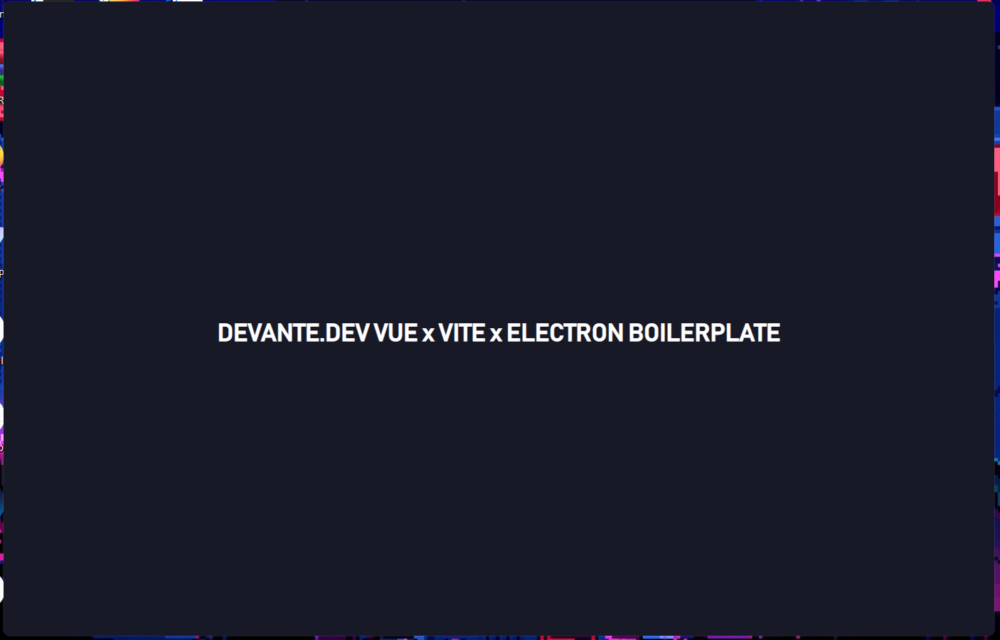

#### Made by [voromade](https://github.com/voromade)

<h1 align="center">☄️ Vue x Vite x Bytenode Electron Boilerplate ☄️</h1>
<h4 align="center">⭐ Don't forget to leave a star! ⭐</h4>

<p align="center">
  
</p>

## Breakdown

- [Vite](https://vitejs.dev/) x [Vue](https://vuejs.org/) for optimal development speeds with amazing structure.
- [electron-builder](https://www.npmjs.com/package/electron-builder) for electron
- [socket.io-client](https://www.npmjs.com/package/socket.io-client) support
- Built in obfuscation on both frontend + backend using [bytenode](https://www.npmjs.com/package/bytenode), [javascript-obfuscator](https://www.npmjs.com/package/javascript-obfuscator) & [uglify-js](https://www.npmjs.com/package/uglify-js).
- [asarmor](https://www.npmjs.com/package/asarmor) to disable basic asar unpacking

## Todo:

- [x] React Version

## Commands

#### **Serve For Development**

```
yarn app:serve
```

#### **Build for production**

```
yarn app:build
```
